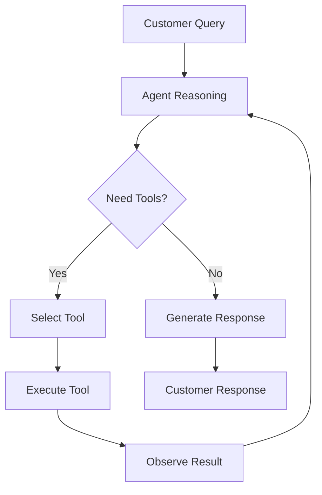
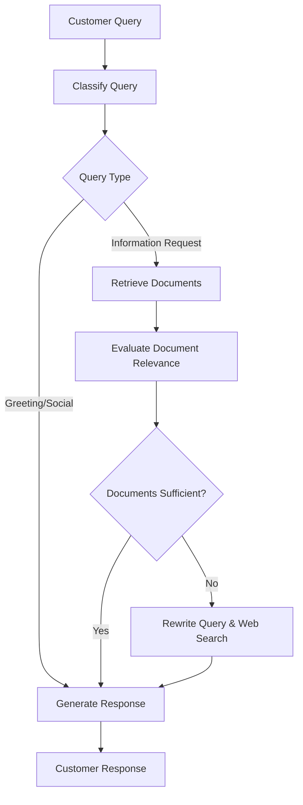

# CarroGPT

CarroGPT is a proof of concept for a customer-facing chatbot developed for **Carro**, an online used car dealership, designed to enhance the customer experience on their website.

We employ 2 different approaches to build the chatbot: **ReAct Agent** and **Corrective RAG**. The ReAct Agent is a dynamic reasoning agent that can handle complex customer inquiries, while Corrective RAG is a more structured approach that ensures accurate responses by validating retrieved documents.

## Built With
* [![Python][Python-img]][Python-url]
* [![uv][uv-img]][uv-url]
* [![LangGraph][langgraph-img]][langgraph-url]
* [![LangChain][langchain-img]][langchain-url]
* [![Qdrant][qdrant-img]][qdrant-url]
* [![OpenAI][openai-img]][openai-url]
* [![Streamlit][streamlit-img]][streamlit-url]

<p align="right">(<a href="#readme-top">back to top</a>)</p>


## Table of Contents

* [Setup](#setup)
* [Project Structure](#project-structure)
* [Backend Architecture](#backend-architecture)

#### RAG Pipeline
* [Approach](#approach)
* [Data Processing](#data-processing)
* [Retrieval](#retrieval)
* [Generation](#generation)
  * [RAG Patterns Overview](#rag-patterns-overview)
  * [LangGraph: Our Chosen Framework](#langgraph-our-chosen-framework)
  * [Understanding Graph Architecture](#understanding-graph-architecture)
  * [ReAct Agent](#react-agent)
  * [Corrective RAG](#corrective-rag)
  * [Framework Comparison](#framework-comparison)

#### Evaluation & Conclusion
* [Testing](#testing)
* [Challenges & Future Work](#challenges--future-work)

* [Other Resources](#other-resources)
  * [Understanding FastAPI Project Structures](#understanding-fastapi-project-structures)
  * [FastAPI Background Tasks & Event Loop Management](#fastapi-background-tasks--event-loop-management)
  
---

## Setup

### Prerequisites

* **Python 3.9+** (we prefer using `uv`, but you can use your preferred Python manager)
* **Docker**
* **Qdrant account** (sign up at [qdrant.tech](https://qdrant.tech/); obtain `QDRANT_URL` & `QDRANT_API_KEY`)
* **OPENAI account** (sign up at [openai.com](https://openai.com/); obtain `OPENAI_API_KEY`)
* **Tavily account** (sign up at [tavily.com](https://tavily.com/); obtain `TAVILY_API_KEY`)
* **Llama Parse account** (sign up at [llama-parse.com](https://www.llamaindex.ai/llamaparse); obtain `LLAMA_PARSE_API_KEY`)


### Running

1. Create a `.env` file in project root Environment Variables and populate it with:

  ```dotenv
  QDRANT_URL=<your-qdrant-url>
  QDRANT_API_KEY=<your-qdrant-api-key>
  OPENAI_API_KEY=<your-openai-api-key>
  TAVILY_API_KEY=<your-tavily-api-key>
  LLAMA_PARSE_API_KEY=<your-llama-parse-api-key>
  ```

2. Build and start all services:

   ```bash
   docker-compose up --build
   ```
   
3. Once containers are healthy:

   * **Backend API** available at `http://localhost:8000`, 
     with interactive swaggerUI API docs at [http://localhost:8000/docs](http://localhost:8000/docs) (click to open)
   * **Streamlit Frontend** at [http://localhost:8501](http://localhost:8501) (click to open)

---

## Project Structure

```text
├── backend
│   ├── Dockerfile
│   ├── main.py
│   ├── pyproject.toml
│   ├── README.md
│   ├── requirements.txt
│   ├── src
│   │   └── app
│   │       ├── __init__.py
│   │       ├── agent_crag
│   │       │   ├── agent
│   │       │   │   ├── nodes/
│   │       │   │   ├── graph.py
│   │       │   │   ├── state.py
│   │       │   │   └── edges.py
│   │       │   ├── router.py
│   │       │   ├── schemas.py
│   │       │   └── services.py
│   │       ├── agent_react
│   │       │   ├── agent
│   │       │   │   ├── nodes/
│   │       │   │   ├── graph.py
│   │       │   │   ├── state.py
│   │       │   │   └── edges.py
│   │       │   ├── router.py
│   │       │   ├── schemas.py
│   │       │   └── service.py
│   │       ├── core
│   │       │   ├── __init__.py
│   │       │   └── config.py
│   │       ├── db
│   │       │   ├── exceptions.py
│   │       │   ├── router.py
│   │       │   ├── schemas.py
│   │       │   ├── service.py
│   │       │   ├── tasks.py
│   │       │   └── utils.py
│   │       ├── main.py
│   │       └── system
│   │           └── router.py
├── frontend
├── docker-compose.yml
└── README.md
```

* **core/**: application settings, configuration and environment loading.
* **db/**: Qdrant-related schemas, services, and utilities for vector storage.
* **agent_crag/** & **agent_react/**: two graph pipelines—Corrective RAG (CRAG) and ReAct agent implementations.
* **agent/**: LangGraph implementations with DAG structure (nodes/, graph.py, state.py, edges.py)

> **Note**: For detailed information about FastAPI project structures, see [Understanding FastAPI Project Structures](#understanding-fastapi-project-structures) in the Other Resources section.

---

## Backend Architecture

Each feature lives in its own package, grouping routers, services, schemas, and related modules:

| Layer        | Component                   | Responsibility                                     |
| ------------ | --------------------------- | -------------------------------------------------- |
| Presentation | `router.py`,  `schemas.py`  | Define HTTP endpoints, request validation, DI      |
| Service      | `service.py`                | Core business logic, orchestration of operations   |
| Data/Infra   | `models.py`, `db/`, `core/` | Persistence (DB access, migrations), external SDKs |

This "package" layout emphasizes domain separation and scalability. Smaller services remain self-contained, easing future extraction into microservices.

---

## Approach

There are three things to think about when building a RAG system:

1. **Data Processing**
   How do we get the information in? For us, PDFs, URLs, or raw text. Key challenge: splitting documents into meaningful chunks (pages vs. sections vs. semantic units).

2. **Retrieval**
   Which chunks satisfy the user's query? Multiple approaches available with different trade-offs.

3. **Generation**
   How to answer once we have context? Various RAG patterns with different capabilities and complexities.

### Options Summary

| Phase | Option | Pros | Cons | Use Case |
|-------|--------|------|------|----------|
| **Retrieval** | Sparse Search | Fast, exact matches | Misses semantic similarity | Keyword-specific queries |
| | Dense Search | Semantic understanding | Computationally expensive | Conceptual queries |
| | Hybrid Search | Best of both worlds | Complex implementation | Production systems |
| **Generation** | Simple RAG | Fast, straightforward | Limited reasoning | Basic Q&A |
| | Corrective RAG | Quality control | Single-pass limitation | Document-focused |
| | ReAct Agent | Multi-step reasoning | Higher latency/cost | Complex queries |
| | Self-RAG | Self-correction | Very complex | High-accuracy needs |

---

## Data Processing

PDF processing is notoriously challenging for RAG systems, as the quality of document chunking directly impacts retrieval accuracy. Our specific use case involves processing **Carro's Terms of Use and FAQ documentation**.

### Initial Attempts: Recursive Character Splitter
Our first approach used LangChain's recursive character text splitter:

```python
splitter = RecursiveCharacterTextSplitter(
    chunk_size=800,
    chunk_overlap=150,
    separators=["\n\n", ". ", "\n", " ", ""],  # Custom separators
)
split_docs = splitter.split_documents(docs)
```

**Results**: Yielded uneven chunks with varying quality. Some chunks were too short to be meaningful, while others were too long and contained multiple distinct topics. This was particularly problematic for Carro's documentation, which contains structured FAQ sections.

### Explored: Unstructured.io
We considered **Unstructured.io** for more sophisticated document parsing, but the package introduced heavy dependencies and complex setup requirements that didn't align with our deployment constraints.

### Current Solution: LLama Parse
We settled on **LLama Parse** for our specific document structure:

```python
parser = LlamaParse(
    api_key=settings.LLAMA_PARSE_API_KEY,
    result_type="text",
    verbose=False,
)
documents = parser.load_data(tmp_path)
```

**Why LLama Parse worked for Carro's documents:**
1. **Page-by-Page Processing**: Carro's Terms of Use and FAQ are structured with logical page breaks
2. **Minimal Chunking Required**: Each page typically contained coherent FAQ sections or complete terms
3. **Balanced Trade-off**: Good parsing quality without complex setup overhead

### Document Context
Our target documents consist primarily of:
- **Carro Terms of Use**: Legal documentation with structured sections
- **FAQ Documentation**: Customer service information organized by topic
- **Service Information**: Details about Carro's used car services

These documents naturally align with page-level processing, making LLama Parse an effective solution for our use case.
Furthermore, the main model we are using is the `gpt-4o-mini`, which has a large context window, allowing us to process these documents in a single pass without needing to split them into smaller chunks.

---

## Retrieval

We selected **Qdrant** as our vector database for several strategic reasons aligned with Carro's requirements:

### Why Qdrant?
* **Generous Free Tier**: Cost-effective for Carro's customer service deployment
* **Managed Service**: Reduces operational overhead for the development team
* **FastEmbed Integration**: Abstracts away embedding complexity—no need for separate embedding infrastructure
* **Low-Latency Performance**: Essential for real-time customer interactions

### Current Implementation
Our retrieval pipeline uses **dense vector search** with Qdrant's built in fastembed library, providing semantic similarity matching for customer queries about Carro's services.

#### Working with Qdrant
We use Qdrant's async client for efficient vector operations:

```python
def get_qdrant_client() -> AsyncQdrantClient:
    """
    Dependency that returns an AsyncQdrantClient instance.
    """
    return AsyncQdrantClient(url=settings.QDRANT_URL, api_key=settings.QDRANT_KEY)

# Query documents with semantic search
results = await qdrant_client.query(
    collection_name=collection_name,
    query_text=query_text,
    limit=top_k,
    # query_filter=qdrant_filter,  # Optional filtering
)
```

The async client integrates seamlessly with FastAPI's async architecture while Qdrant's built-in FastEmbed handles embedding generation automatically.

---

## Generation

### RAG Patterns Overview

Different RAG patterns offer varying capabilities for handling customer queries:

| Pattern            | Description                                      | Complexity | Best For                                             |
| ------------------ | ------------------------------------------------ | ---------- | ---------------------------------------------------- |
| **Simple RAG**     | Retrieve → generate with no extra validation     | Low        | Basic FAQ & lightweight KB lookups                   |
| **Corrective RAG** | Adds relevance grading and query refinement      | Medium     | Document-focused customer service with moderate SLAs |
| **ReAct Agent**    | Single-agent chain-of-thought + tool calls       | Depends    | Complex queries needing real-time data & reasoning   |
| **Self-RAG**       | Iterative self-reflection & critique tokens      | Very High  | High-stakes accuracy tasks (legal, medical)          |
| **Agentic RAG**    | Multi-agent collaboration with specialized roles | Very High  | Enterprise-scale workflows requiring modular agents  |

For this project, we explored **ReAct Agent** and **Corrective RAG**. We wanted to balance the need for real-time data integration with the ability to handle complex customer inquiries while maintaining a predictable and reliable response flow. But also we wanted to compare the two approaches to see which one would be more suitable for Carro's customer service requirements, with React Agent being more exploratory and Corrective RAG being more structured. 

### LangGraph: Our Chosen Framework

We chose **LangGraph** over traditional LangChain agents for Carro's specific requirements:

#### Why LangGraph for Customer Service?

Even though we're familiar with LangChain's traditional agent framework, we decided to move to LangGraph for several compelling reasons:

* **Real-time Tool Integration**: Essential for current pricing and inventory queries
* **Transparent Reasoning**: Customers can see how the bot arrived at answers  
* **Graph-Based Design**: Explicit control flow for reliable customer interactions
* **Streaming Responses**: Immediate feedback during complex query processing
* **Future Direction**: LangChain has indicated that their Agent Executor pattern is moving towards LangGraph as the recommended approach for complex agent workflows

This shift aligns with LangChain's own roadmap, where they're positioning LangGraph as the successor to traditional agent patterns for scenarios requiring sophisticated reasoning and tool orchestration.

### Understanding Graph Architecture

LangGraph uses **Directed Acyclic Graphs (DAGs)** to model agent reasoning flows. Our implementation structure:

```text
agent/
├── nodes/          # Individual processing steps
├── graph.py        # DAG definition and compilation
├── state.py        # Shared state management
└── edges.py        # Conditional routing logic
```

This modular approach allows us to:
- **Isolate Logic**: Each node handles a specific responsibility
- **Control Flow**: Explicit routing between processing steps
- **State Management**: Consistent data flow throughout the conversation
- **Debugging**: Clear visibility into agent decision-making

#### Memory Management with Thread-Scoped State

LangGraph implements memory through thread-scoped checkpoints:

```python
config = {"configurable": {"thread_id": thread_id}}
```

**Short-term memory** lets your application remember previous interactions within a single thread or conversation. A thread organizes multiple interactions in a session, similar to how email groups messages in a single conversation.

LangGraph manages short-term memory as part of the agent's state, persisted via thread-scoped checkpoints. This state normally includes the conversation history along with other stateful data, such as uploaded files, retrieved documents, or generated artifacts. By storing these in the graph's state, the bot can access the full context for a given conversation while maintaining separation between different threads.

### ReAct Agent

A dynamic reasoning agent perfect for complex customer inquiries:

#### Simple Implementation
To build a React Agent is easy with LangGraph's `create_react_agent` function, which allows us to define the agent's behavior and tools it can use.

```python
def create_graph():
    """Create the ReAct agent graph."""

    # Initialize LLM
    llm = ChatOpenAI(
        model="gpt-4o-mini",
        temperature=0,
        streaming=True,
        api_key=settings.OPENAI_API_KEY,
    )

    # Build a ReAct agent with create_react_agent
    graph = create_react_agent(
        model=llm,
        tools=tools,
        prompt=SYSTEM_PROMPT,
        checkpointer=MemorySaver(),
    )

    return graph
```

> **Note**: For a more comprehensive implementation, see `backend/src/app/agent_react/agent/graph_scratch.py`.

#### Graph Structure


#### Advantages
* **Low Complexity**: Easy to implement and maintain
* **Dynamic Tool Selection**: Chooses between FAQ lookup, web search, or pricing APIs
* **Streaming Responses**: Customers see progress in real-time
* **Multi-step Reasoning**: Handles complex inquiries about financing, trade-ins, etc.

### Corrective RAG

Optimized for reliable and accurate FAQ and document-based responses:

#### Implementation Flow
```python
def create_graph():
    """
    Create the full graph for the Carro chatbot agent.
    Flow:
    1. classify_query
    2. If greeting/irrelevant: generator
       Else: retriever
    3. evaluate_documents (filter & set needs_web_search)
    4. If needs_web_search: rewrite_query → web_search → generator
       Else: generator
    """

    workflow = StateGraph(State)

    # Add nodes
    workflow.add_node("classifier", classify_query)
    workflow.add_node("retriever", retrieve_documents)
    workflow.add_node("evaluator", evaluate_documents)
    workflow.add_node("query_rewriter", rewrite_query)
    workflow.add_node("web_search", search_web)
    workflow.add_node("generator", generate_response)

    # Start → classifier
    workflow.add_edge(START, "classifier")

    # classifier → (via decide_next_step) → retriever or generator
    workflow.add_conditional_edges(
        "classifier",
        decide_next_step,
        {"retriever": "retriever", "generator": "generator"},
    )

    # retriever → evaluator
    workflow.add_edge("retriever", "evaluator")

    # evaluator → (via should_search_web) → query_rewriter or generator
    workflow.add_conditional_edges(
        "evaluator",
        should_search_web,
        {"query_rewriter": "query_rewriter", "generator": "generator"},
    )

    # query_rewriter → web_search → generator
    workflow.add_edge("query_rewriter", "web_search")
    workflow.add_edge("web_search", "generator")

    # generator → END
    workflow.add_edge("generator", END)

    # Compile graph with memory saver
    graph = workflow.compile(checkpointer=MemorySaver())
    return graph
```

#### Graph Structure


#### Advantages for Carro
* **Query Classification**: Separates greetings from information requests, can route to more complex flows or specialized agents if needed in the future
* **Quality Control**: Ensures retrieved documents are relevant to customer needs, thereby reducing hallucinations
* **Web Search Fallback**: Gets current pricing/inventory when internal docs insufficient

### Framework Comparison

| Aspect | ReAct Agent | Corrective RAG |
|--------|-------------|----------------|
| **Customer Query Complexity** | Multi-step, exploratory | Single-focused, direct |
| **Real-time Data Integration** | Dynamic tool selection | Fallback web search only |
| **Response Predictability** | Variable (exploration-based) | High (structured flow) |
| **Operational Cost** | Lower (fewer LLM calls) | Higher (multiple LLM calls) |
| **Accuracy & Control** | Agent-driven decisions | Explicit quality control |
| **Implementation Effort** | Easy setup | More complex validation |

#### Choosing the Right Approach

**ReAct Agent** works well for general customer support where you can trust the agent to make reasonable decisions. It's straightforward to implement and cost-effective for most queries.

**Corrective RAG** provides much more accuracy and control but at higher operational cost. This approach is ideal for high-stakes environments like medical systems where hallucination control is critical.

For Carro's general customer support bot, ReAct's simplicity makes it attractive. However, for sensitive policy questions or warranty claims, adding one or two validation nodes (similar to CRAG's approach) would help prevent hallucinations in critical areas.

---

## Testing

**TBC** - If have time:

- **DeepEval**: LLM application testing framework [link](https://github.com/confident-ai/deepeval)
- **RAGAS**: RAG-specific evaluation metrics [link](https://github.com/explodinggradients/ragas)

### Outputs

*Placeholder for comprehensive test scenarios covering:*
- FAQ accuracy validation
- Real-time data integration testing
- Error handling verification
- Customer conversation flow testing

TBC

---

## Challenges & Future Work

### Current Challenges

#### PDF Processing
Balancing chunk granularity with semantic coherence remains one of our biggest challenges. Chunking PDFs into meaningful pieces is way harder than it sounds—sometimes you end up splitting up content that should stay together, or you get chunks that are too broad or too narrow.

#### Retrieval Reliability  
Even with semantic search, the retrieval step can be unreliable: the model might fetch something that looks similar on paper but just doesn't make sense for the user's actual question. In practice, pure semantic retrieval often falls short, which is why hybrid approaches (mixing keyword and semantic search) tend to work better.

From what we've observed, the most unstable part of RAG is the retrieval step—modern LLMs are usually great at generating answers if you give them the right context, but getting that context reliably is the real challenge. That's also why we experimented with Corrective RAG, to add more quality control and fallback logic.

### Future Enhancements

#### Hybrid Search Implementation
**Hybrid Search with Qdrant Fusion**: Combining dense (semantic) and sparse (keyword) retrieval approaches:

* **Dense Retrieval**: Current semantic vector approach for conceptual understanding
* **Sparse Retrieval**: Keyword-based search for exact term matching (critical for specific car models, pricing terms, policy details)
* **Fusion Ranking**: Optimized scoring mechanism that weighs both semantic similarity and keyword relevance

This hybrid approach will be particularly valuable for Carro customers asking about specific car models, exact pricing details, or precise policy terms where keyword matching is essential alongside semantic understanding.

#### Infrastructure & Operations
- [ ] **Redis / Celery**: Dedicated queue for asynchronous PDF processing and background tasks  
- [ ] **ML-based Semantic Parsing**: Automotive document understanding using machine learning models  
- [ ] **Hydra**: Flexible configuration management and easy model swapping  

#### Evaluation & Quality Assurance
- [ ] **Evaluation Frameworks (DeepEval, RAGAS)**: Comprehensive RAG quality assessment and automated testing to measure retrieval accuracy and generation quality

---

## Other Resources

### Understanding FastAPI Project Structures

FastAPI apps can adopt different directory layouts depending on team size and project complexity.

#### 1.1 Structuring by File-Type

Organize by technical layer: all routers together, all schemas together, etc.

```
app/
├── main.py
├── dependencies.py
├── routers/
│   ├── items.py
│   └── users.py
├── crud/
│   ├── item.py
│   └── user.py
├── schemas/
│   ├── item.py
│   └── user.py
├── models/
│   ├── item.py
│   └── user.py
└── core/
    └── config.py
```

* **Pros**: Clear separation by technical concern. Familiar to many developers.
* **Cons**: Feature-based changes span multiple directories; can become unwieldy as features grow.

#### 1.2 Structuring by Module/Functionality (Package Layout)

Group by feature or domain, each with its own routers, services, schemas, and models.

```
src/
├── auth/
│   ├── router.py
│   ├── service.py
│   ├── schemas.py
│   └── models.py
├── posts/
│   ├── router.py
│   ├── service.py
│   ├── schemas.py
│   └── models.py
├── core/
│   ├── config.py
│   └── database.py
└── main.py
```

* **Pros**: Excellent separation by business capability; easy to scale across teams; modules can be split into microservices.
* **Cons**: Can feel heavyweight for small projects; requires upfront planning of module boundaries.

### FastAPI Background Tasks & Event Loop Management

One of the key architectural decisions we made involves handling long-running document processing operations. Here's a case study of our approach and the evolution toward production-ready solutions:

#### The Problem: Long-Running Document Processing

Initially, document uploading and processing was taking too long, blocking the main request thread and creating poor user experience.

#### Current Solution: Background Tasks with Sync Processing

We use **FastAPI Background Tasks** (a wrapper around **Starlette's BackgroundTasks**) with an important architectural choice:

```python
# Schedule background task for processing
background_tasks.add_task(
    process_documents,  # This is a SYNC function
    collection_name,
    buffered,
    urls or [],
)
```

##### Why Sync Over Async for Background Tasks?

The key insight about **event loop management**:

* **If async**: The function runs in the same event loop as the FastAPI request, which would block the request until processing completes, defeating the purpose of background processing.

* **If sync**: The function executes in a separate thread, allowing the FastAPI main application to continue processing other requests while document processing happens in the background.

#### Production-Ready Solution: Celery + Redis Queue Management

While FastAPI Background Tasks work for development and small-scale deployments, **the recommended production approach is offloading work to a dedicated task queue system**:

```python
# Redis + Celery Architecture
from celery import Celery

celery_app = Celery(
    "carrobot",
    broker="redis://localhost:6379/0",
    backend="redis://localhost:6379/0"
)

@celery_app.task(bind=True, max_retries=3)
def process_documents_task(self, collection_name: str, documents: list, urls: list):
    try:
        # Long-running document processing
        result = process_documents(collection_name, documents, urls)
        return {"status": "success", "result": result}
    except Exception as exc:
        # Exponential backoff retry mechanism
        raise self.retry(exc=exc, countdown=60 * (2 ** self.request.retries))

# In your FastAPI endpoint
@router.post("/upload-documents")
async def upload_documents(background_tasks: BackgroundTasks):
    # Queue the task instead of using background_tasks
    task = process_documents_task.delay(collection_name, documents, urls)
    return {"task_id": task.id, "status": "processing"}
```

#### Why Celery + Redis is Superior for Production

| Aspect | FastAPI Background Tasks | Celery + Redis |
|--------|-------------------------|----------------|
| **Fault Tolerance** | No retry mechanism | Built-in retry with exponential backoff |
| **Scalability** | Limited to single server | Distributed across multiple workers |
| **Monitoring** | No visibility into task status | Rich monitoring with Flower, task tracking |
| **Resource Management** | Consumes main app resources | Isolated worker processes |
| **Persistence** | Tasks lost on app restart | Durable task persistence in Redis |
| **Load Distribution** | Single-threaded execution | Multiple workers, automatic load balancing |

#### Key Advantages of Queue-Based Architecture

##### 1. **Retry Mechanisms**
```python
@celery_app.task(bind=True, max_retries=3, default_retry_delay=60)
def process_documents_task(self, collection_name, documents, urls):
    try:
        return process_documents(collection_name, documents, urls)
    except (ConnectionError, TimeoutError) as exc:
        # Retry with exponential backoff for transient failures
        raise self.retry(exc=exc, countdown=60 * (2 ** self.request.retries))
    except ValidationError as exc:
        # Don't retry for validation errors
        raise exc
```

##### 2. **Resource Isolation**
- **Main FastAPI app**: Handles HTTP requests, user interactions, real-time responses
- **Celery workers**: Handle CPU/memory-intensive document processing, PDF parsing, vector embedding

##### 3. **Horizontal Scaling**
```bash
# Scale workers independently based on load
celery -A carrobot worker --loglevel=info --concurrency=4
celery -A carrobot worker --loglevel=info --concurrency=8  # More workers for heavy load
```

##### 4. **Task Monitoring & Observability**
```python
# Track task progress
@router.get("/task-status/{task_id}")
async def get_task_status(task_id: str):
    task = process_documents_task.AsyncResult(task_id)
    return {
        "task_id": task_id,
        "status": task.status,
        "result": task.result if task.ready() else None,
        "progress": task.info if task.status == "PROGRESS" else None
    }
```

#### Implementation Strategy for Carro

For **CarroBot's evolution toward production**:

1. **Phase 1** (Current): FastAPI Background Tasks for MVP and development
2. **Phase 2** (Production): Migrate to Celery + Redis for:
   - **Document processing pipeline**: PDF parsing, chunking, embedding generation
   - **Batch operations**: Bulk document uploads, collection rebuilding
   - **Scheduled tasks**: Periodic data refresh, cleanup operations

##### Recommended Architecture
```
┌─────────────────┐    ┌─────────────────┐    ┌─────────────────┐
│   FastAPI App   │    │   Redis Queue   │    │ Celery Workers  │
│                 │    │                 │    │                 │
│ • HTTP endpoints│───▶│ • Task storage  │───▶│ • Doc processing│
│ • Real-time chat│    │ • Result cache  │    │ • PDF parsing   │
│ • User sessions │    │ • Task tracking │    │ • Vector embed  │
└─────────────────┘    └─────────────────┘    └─────────────────┘
```

This architecture provides the reliability, scalability, and operational visibility needed for Carro's production customer service requirements while maintaining the development simplicity we currently enjoy.

#### Alternative: ProcessPoolExecutor

For smaller deployments without Redis infrastructure, you could consider using Python's `ProcessPoolExecutor` instead of thread-based background tasks, especially for CPU-intensive operations that don't require shared database connections:

```python
import asyncio
from concurrent.futures import ProcessPoolExecutor

async def process_documents_with_executor(documents):
    loop = asyncio.get_event_loop()
    with ProcessPoolExecutor() as executor:
        result = await loop.run_in_executor(executor, cpu_intensive_processing, documents)
    return result
```

However, this still lacks the retry mechanisms, monitoring, and distributed processing capabilities that make Celery the preferred choice for production systems.

---

<p align="right">(<a href="#readme-top">back to top</a>)</p>

[Python-img]: https://img.shields.io/badge/python-3.9%2B-blue.svg
[Python-url]: https://www.python.org/
[uv-img]: https://img.shields.io/badge/uv-%5E0.20.0-orange.svg
[uv-url]: https://github.com/astral-sh/uv
[streamlit-img]: https://img.shields.io/badge/streamlit-%5E1.XX-red.svg
[streamlit-url]: https://streamlit.io/
[qdrant-img]: https://img.shields.io/badge/qdrant-%5E1.1.0-purple.svg
[qdrant-url]: https://qdrant.tech/
[langgraph-img]: https://img.shields.io/badge/langgraph-latest-green.svg
[langgraph-url]: https://github.com/langchain-ai/langgraph
[langchain-img]: https://img.shields.io/badge/langchain-latest-yellow.svg
[langchain-url]: https://python.langchain.com/
[openai-img]: https://img.shields.io/badge/openai-api-black.svg
[openai-url]: https://openai.com/